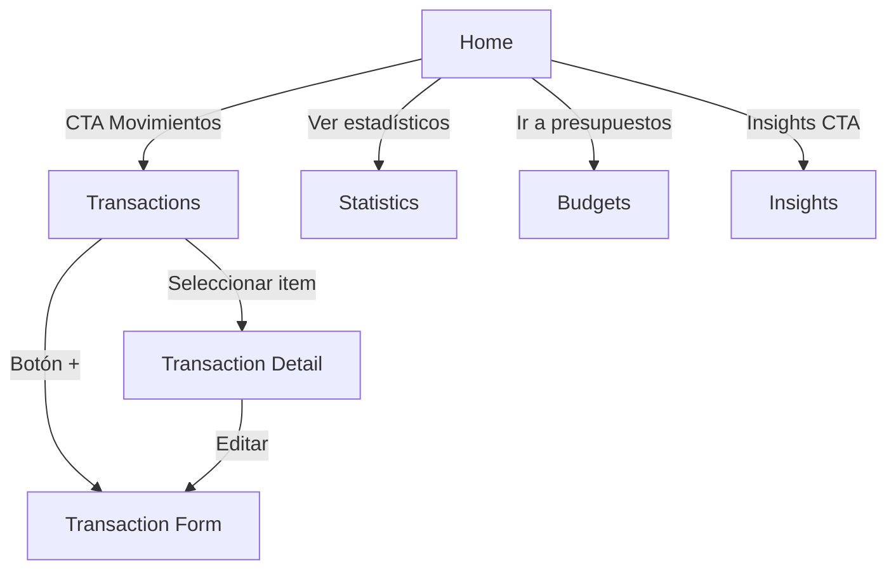
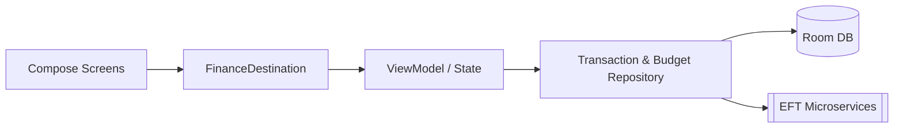
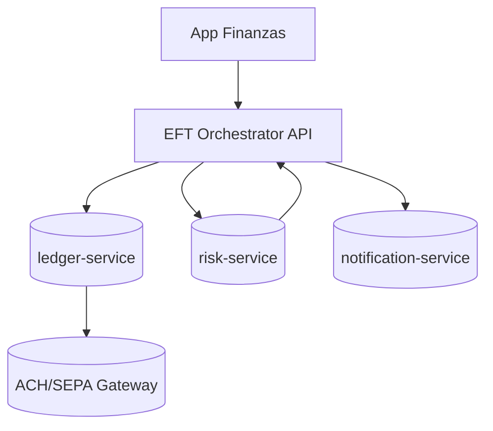

# Arquitectura, contexto EFT y guías operativas

Este documento amplía la descripción técnica de la app **Finanzas 3.0** y explica
cómo el cliente Android se acopla a un ecosistema de microservicios EFT
(Electronic Funds Transfer) para mover dinero de forma segura.

## 1. Contexto EFT

| Dimensión | Detalle |
| --- | --- |
| **Objetivos** | Facilitar transferencias EFT inmediatas, ofrecer visibilidad de cuentas y presupuestos y disparar insights proactivos para prevenir descubiertos. |
| **Actores** | Usuario final autenticado en el móvil, orquestador móvil (app Android), microservicios KYC y ledger, pasarela ACH/SEPA externa, y mesa de monitoreo antifraude. |
| **Supuestos** | Usuario ya completó onboarding KYC, los saldos bancarios se sincronizan vía APIs PSD2/OB, y las reglas de límite se definen en `BudgetRepository`. |
| **Controles de seguridad** | En repositorio local se cifra Room con cifrado a nivel de dispositivo (requisito del sistema operativo), el tráfico saliente aplica TLS 1.3 y mutual TLS hacia microservicios, autenticación OIDC + MFA para iniciar sesión y monitoreo continuo (alertas desde risk-service). |

## 2. Componentes móviles

- **Actividad anfitriona**: `MainActivity` crea la instancia `AppDatabase`, inicializa los repositorios de transacciones y presupuestos, y arranca la navegación Compose con el perfil del usuario autenticado.  La construcción ocurre en `app/src/main/java/com/example/app_finanzas/MainActivity.kt`.
- **Persistencia**: `AppDatabase` agrupa los DAO de usuarios, transacciones y presupuestos (Room v2.6.1) y habilita migraciones destructivas para simplificar el demo (`app/src/main/java/com/example/app_finanzas/data/local/AppDatabase.kt`).
- **Repositorios**: `TransactionRepository` y `BudgetRepository` encapsulan la lógica de dominio (mapeos, datos sembrados, validaciones) que consumen las pantallas Compose (`app/src/main/java/com/example/app_finanzas/data/transaction/TransactionRepository.kt` y `app/src/main/java/com/example/app_finanzas/data/budget/BudgetRepository.kt`).
- **UI y navegación**: `FinanceApp` define los destinos del gráfico animado (Home, Transactions, Statistics, Budgets, Detail, Form, Insights) usando `AnimatedNavHost` y Accompanist para las transiciones (`app/src/main/java/com/example/app_finanzas/navigation/FinanceApp.kt`).

## 3. Dependencias clave

| Categoría | Librerías | Uso principal |
| --- | --- | --- |
| UI | Jetpack Compose BOM 2024.09, Material 3, Icons Extended | Renderizar pantallas reactivas y componentes M3. |
| Navegación | `androidx.navigation.compose`, `accompanist-navigation-animation` | Transiciones con animaciones entre destinos declarativos. |
| Persistencia | Room (`runtime`, `ktx`, `compiler`) | Almacenar transacciones, presupuestos y perfiles locales. |
| Lógica / estado | `androidx.lifecycle.viewmodel.compose`, `lifecycle-runtime-ktx` | Gestionar estados y scopes basados en ViewModel. |
| Tooling / pruebas | JUnit 4.13.2, Espresso 3.7.0, Compose UI test | Automatizar pruebas unitarias e instrumentadas. |

La fuente de verdad para versiones se encuentra en `gradle/libs.versions.toml`,
mientras que las dependencias del módulo se declaran en
`app/build.gradle.kts`.

## 4. Capas lógicas y flujo de datos

1. **Presentación** (Compose + ViewModel) recibe el estado observable desde los repositorios.
2. **Navegación** (FinanceDestination) enruta eventos del usuario hacia pantallas específicas.
3. **Dominio** (repositorios) normaliza las entidades y aplica reglas como `ensureSeedData`.
4. **Persistencia local** (Room DAO) almacena transacciones y presupuestos.
5. **Servicios EFT** (microservicios) sincronizan saldos, validan límites y emiten alertas.

Los eventos del usuario (por ejemplo, registrar una transacción) viajan desde la UI
hacia el repositorio, se guardan en Room y después se replican a `ledger-service`
vía el adaptador de sincronización (pendiente de implementación en esta rama).

## 5. Flujos funcionales destacados

- **Ingreso y registro**: la experiencia Auth construye el perfil (`UserProfile`) y
  lanza `MainActivity`, que rehidrata el estado financiero antes de dibujar Home.
- **Home / Insights**: `HomeRoute` observa `TransactionRepository.observeTransactions()`
  para calcular balances y disparar accesos directos hacia Insights y Statistics.
- **Budgets**: `BudgetRepository.ensureSeedData()` crea metas iniciales si la tabla
  está vacía, dando contexto visual desde la primera ejecución.

## 6. Diagramas Mermaid

### 6.1 Navegación principal

### 6.2 Capas móviles

### 6.3 Microservicios EFT propuestos

### 6.4 Deep links y formularios auditados

- Cada destino del `AnimatedNavHost` expone un deep link semántico con el
  esquema `financeapp://finanzas/...` para integrarse con notificaciones y
  accesos directos. Ejemplos: `financeapp://finanzas/home`,
  `financeapp://finanzas/transactions/{transactionId}` y
  `financeapp://finanzas/transactions/new`.
- Las rutas sensibles a parámetros (`TransactionDetail` y `TransactionForm`
  en modo edición) definen explícitamente sus `navArgument` de tipo `Int` para
  garantizar que los IDs se resuelvan antes de renderizar la pantalla.
- Los formularios de movimientos y presupuestos reutilizan el componente
  `FinanceTextField` para alinear el estilo Material 3, exponen estados de error
  por campo y habilitan los botones sólo cuando la validación local se cumple.

## 7. Ejecución y pruebas

### 7.1 App Android
1. `./gradlew :app:assembleDebug` para compilar.
2. Abrir el proyecto en Android Studio Koala+, sincronizar y ejecutar sobre un
   emulador API 24 o superior.

### 7.2 Microservicios de referencia
1. Copiar `docs/microservices/docker-compose.example.yml` como `docker-compose.yml`.
2. `cd docs/microservices && docker compose up --build` para exponer los stubs de
   ledger (8081), risk (8082) y notifications (8083).

### 7.3 Pruebas
- **Unitarias**: `./gradlew :app:testDebugUnitTest`.
- **Instrumentadas**: `./gradlew :app:connectedDebugAndroidTest` (requiere un
  dispositivo/emulador disponible).

Estas pruebas se apoyan en los repositorios y DAO descritos en las secciones
previas para garantizar la consistencia de los flujos EFT.
